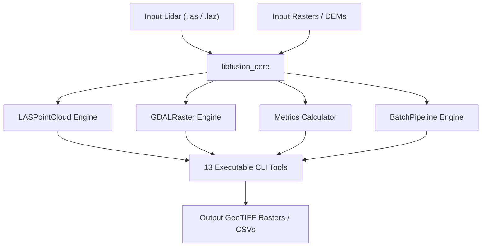

# FUSION Update Documentation Suite

Welcome to the technical documentation suite for **FUSION Update**, a modern GDAL-based raster handling and native LAS/LAZ point cloud engine for forestry lidar data processing, terrain analysis, individual tree detection, and batch processing.

Originally developed by Robert J. McGaughey at the USDA Forest Service / Pacific Northwest Research Station, the FUSION software suite provides comprehensive tools for processing airborne laser scanning (ALS) and terrestrial point cloud datasets. This modern update replaces legacy binary formats with standard GDAL rasters (GeoTIFF, VRT) and direct `.las`/`.laz` reader/writer infrastructure.

---

## Documentation Contents

This documentation suite is organized into three primary reference guides:

### 1. [C++ Core Library API Reference](API_REFERENCE.md)
Detailed specification of the `libfusion_core` developer API, including headers, namespaces, classes, methods, signatures, parameters, return types, and memory management patterns:
- **`fusion::lidar::LASReader` & `LASWriter`**: Point cloud reader/writer supporting LAS 1.0–1.4 and LAZ compression.
- **`fusion::raster::GDALRaster`**: Multi-band and single-band raster processing, elevation interpolation, and VRT compilation.
- **`fusion::batch::BatchPipeline`**: Parallel multi-threaded spatial tiling engine with buffer management.
- **`fusion::metrics`**: High-performance experimental lidar metric computation engine.
- **`fusion::cli::ArgumentParser`**: Command-line argument parsing and flag handling.
- **`fusion::batch::StatusMessenger`**: Thread-safe status logging and progress monitor.

### 2. [Lidar & Terrain Metrics Reference](METRICS_REFERENCE.md)
Scientific manual detailing every metric computed by `gridmetrics`, `cloudmetrics`, and `ExperimentalMetrics`:
- Statistical elevation metrics (mean, median, percentiles, skewness, kurtosis, IQR).
- Canopy cover, canopy relief ratio ($CRR$), and height threshold proportions.
- Return intensity statistics and pulse/return density ratios.
- Novel 2D and 3D spatial metrics (relative height ratios, radial distance variance, XY/XYZ correlations, columnar grid volume, and 3D voxel volume occupancy).

### 3. [Executable Suite & CLI Tools Reference](CLI_TOOLS_REFERENCE.md)
User guide for all 13 command-line executables:
- `gridmetrics.exe`, `cloudmetrics.exe`, `canopymodel.exe`, `canopymaxima.exe`, `treeseg.exe`, `groundfilter.exe`, `clipdata.exe`, `filterdata.exe`, `thindata.exe`, `returndensity.exe`, `topometrics.exe`, `catalog.exe`, and `ltktools.exe`.

---

## Architectural Overview



---

## Building Documentation

To re-render this documentation locally into HTML and PDF formats using Quarto, run the main build script from the repository root:

```powershell
.\build.ps1
```

Or execute Quarto directly:

```bash
quarto render docs
```

The rendered outputs will be placed in:
- `docs/output/html/`: Interactive HTML documentation site.
- `docs/pdf/FUSION_Documentation.pdf`: Standalone PDF reference manual.
