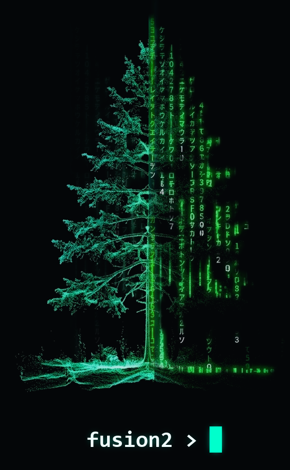

# Preface {.unnumbered}



```{=typst}
#align(center, image("assets/fusion2_logo.png", width: 1.2in, alt: "FUSION2 Logo"))
#v(0.5em)
```

FUSION2 is a set of 15 command-line tools for turning airborne lidar point
clouds into the products forest inventory and monitoring work depends on:
ground surfaces, canopy height models, gridded height and density metrics,
plot-level summaries, and individual tree tops and crowns. Each tool is a
single Windows executable that reads LAS or LAZ point clouds (or GeoTIFF
rasters) and writes GeoTIFF rasters, LAS/LAZ point clouds, or CSV and
SQLite tables that open directly in GIS software and in R or Python.

FUSION2 is derived from the stand-alone command-line programs in legacy
FUSION (version 4.40), written by Robert J. McGaughey at the USDA Forest
Service Pacific Northwest Research Station. FUSION2 keeps legacy FUSION's
tool names and option style (`/option:value`), so existing batch scripts
port with few changes. It replaces legacy FUSION's own `.dtm` raster
format with GeoTIFF, reads and writes LAS 1.0-1.4 and LAZ directly, and
adds batch processing across many tiles. @sec-legacy-gaps lists the
legacy FUSION programs FUSION2 does not include.

## Which tool do I need?

| Task | FUSION2 tool | Chapter |
|:------------------------------|:----------|:----------|
| Summarize point counts, extents, and density of a set of files | `catalog` | @sec-catalog |
| Keep points by return number, classification, or elevation | `filterdata` | @sec-filterdata |
| Reduce point density to at most one point per cell | `thindata` | @sec-thindata |
| Classify ground points and build a ground surface (DEM) | `groundfilter` | @sec-groundfilter |
| Cut out boxes, plots, or height ranges of points | `clipdata` | @sec-clipdata |
| Build a canopy height model | `canopymodel` | @sec-canopymodel |
| Map point density and the share of first returns | `returndensity` | @sec-returndensity |
| Map returns by height layer | `densitymetrics` | @sec-densitymetrics |
| Compute gridded height, cover, and intensity metrics | `gridmetrics` | @sec-gridmetrics |
| Compute the same metrics for a whole file or for each plot | `cloudmetrics` | @sec-cloudmetrics |
| Compute slope and aspect from a ground surface | `topometrics` | @sec-topometrics |
| Measure surface roughness and volume between two surfaces | `gridsurfacestats` | @sec-gridsurfacestats |
| Find individual tree tops | `canopymaxima` | @sec-canopymaxima |
| Outline individual tree crowns | `treeseg` | @sec-treeseg |
| Run several tools tile by tile over a large area | `pipeline` | @sec-pipeline, @sec-many-tiles |

: FUSION2 tools by task. {#tbl-tools-by-task}

## A typical workflow

Most projects run the tools in the same order, because later tools need
the ground surface that an earlier tool builds:

1. **Check the data** with `catalog`: point counts, extents, and density
   per file.
2. **Build the ground surface** with `groundfilter`. Every tool that
   reports height above ground reads this surface.
3. **Build the canopy height model** with `canopymodel`, using that ground
   surface.
4. **Compute area-based metrics** with `gridmetrics` (for wall-to-wall
   maps) and `cloudmetrics` (for field plots).
5. **Detect trees** with `canopymaxima` and `treeseg`, working from the
   canopy height model.
6. **Scale up** with `pipeline`, which runs the same chain tile by tile
   across a whole project area and stitches the results.

## How this manual is organized

- **Getting started** covers installing the tools, a four-command quick
  start, and the conventions every tool shares: option syntax, point
  filtering, units, missing values, and coordinate systems.
- **Worked examples, tool by tool** gives each tool its own chapter. Each
  chapter explains what the tool does, shows the exact commands used on
  one example lidar tile, explains every option in those commands, shows
  figures drawn from the tool's actual output, and lists the automated
  checks that output passed.
- **Reference** lists every option of every tool, each tool's built-in
  help text, the definitions of every metric, and the C++ library
  interface for developers.
- **Appendices** report how FUSION2 is tested: the unit tests that run on
  every build, and the full set of automated checks on the example tile.
  They also list the legacy FUSION programs not included and the
  changelog.

## Where the examples come from

Every command, figure, and check in the worked-example chapters comes from
one scripted run of all 15 tools on a single example tile, kept in the
companion repository
[FUSION2-examples](https://github.com/jstrunk001/FUSION2-examples). That
run checks each tool's output against an independent calculation made in
R with the `lidR`, `terra`, and `sf` packages. The commands shown are
exactly the commands that run executed. @sec-example-tile describes the
tile and how to reproduce the run.

## Building this manual

The manual is a Quarto book in the FUSION2 repository's `docs/` folder.
`build.ps1` renders it to an HTML site (`docs/output/`) and a PDF
(`docs/pdf/FUSION2_Manual.pdf`), and bundles the PDF with each release.
To render it on its own:

```powershell
quarto render docs
```
